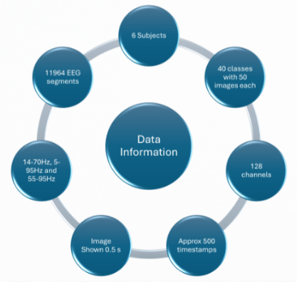
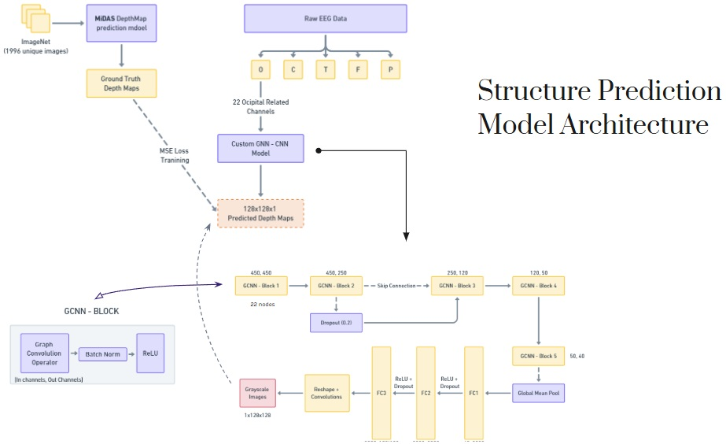
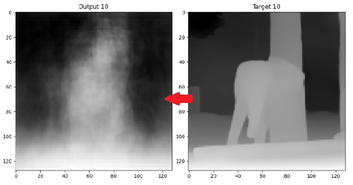
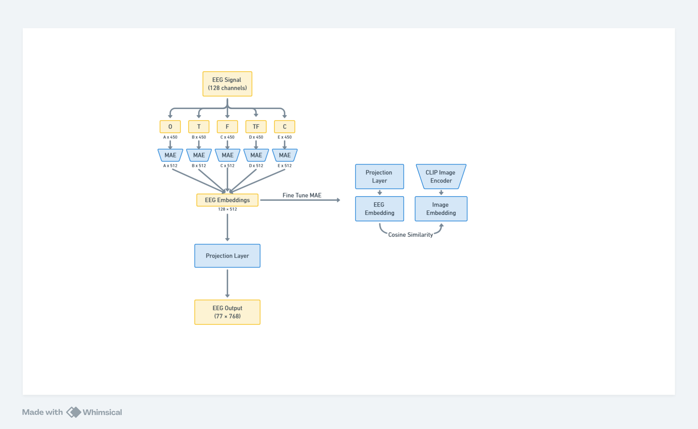
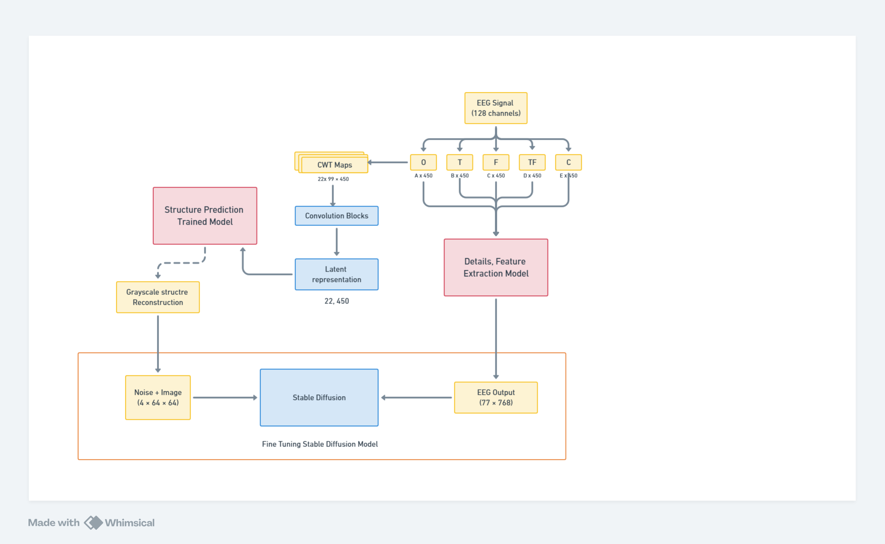

# Visual EEG Reconstruction

## Project Description

This project focuses on visual image decoding from EEG signals. The goal is to reconstruct images based on EEG data collected from patients who viewed those images. The proposed model consists of two main parts: structure prediction and details/context prediction. An overview of our model archetecture is shown below

## Dataset

This project uses the EEGImageNet dataset. Here are some key details:

- **Patients:** The dataset includes EEG data from 6 patients.
- **Readings:** There are 11,965 readings in the dataset.
- **Images:** The readings correspond to 1,196 unique ImageNet images. These images are spread over 40 classes, with each class containing around 50 images.
- **Preprocessing:** We used the 5-95 filtered dataset. The varying time domain was cut to a constant 450 units for all the EEG data.

You can find more about the dataset [here](https://tinyurl.com/eeg-visual-classification).

### Structure Prediction

In the structure prediction part, the 128-channel, 450-timestep EEG data is first divided into 5 bins based on their regions (occipital, central, temporal, parietal, frontal). The occipital channels, specifically the 22 occipital-related channels, are used for structure prediction. These channels are treated as nodes in a graph convolutional neural network (GCNN) model.

The input to the GCNN model is a tensor of shape (22, 450), representing the occipital channels over time. The output of the GCNN model is a tensor of shape (1, 128, 128), which represents the predicted structure of the image. This predicted structure is then compared to the depth map of the corresponding image and trained using MSE loss.

### Details and Context Prediction

The second part of our model focuses on predicting the details and context of the images. We use Masked Autoencoders (MAE) to embed all EEG channels into a 1x512 dimension for each. These embeddings are then fine-tuned using CLIP embeddings of the images. The fine-tuned embeddings pass through projection layers, reshaping them to 77x768, which aligns with the conditional input space required for Stable Diffusion.

### Reconstruction Phase

In the final phase, we combine the conditional input and the noised image input. The Stable Diffusion model is fine-tuned to utilize this combined input, producing the desired image reconstructions. By integrating these components, our model aims to reconstruct visual images from EEG data with improved accuracy and detail.

## Video Link For Explaination

For video explaination of the structure and other details find at https://youtu.be/Gk2WOzbFVoQ

### Citations

- S. Palazzo, C. Spampinato, I. Kavasidis, D. Giordano, J. Schmidt, M. Shah, Decoding Brain Representations by Multimodal Learning of Neural Activity and Visual Features, IEEE TRANSACTIONS ON PATTERN ANALYSIS AND MACHINE INTELLIGENCE, 2020, doi: 10.1109/TPAMI.2020.2995909
- C. Spampinato, S. Palazzo, I. Kavasidis, D. Giordano, N. Souly, M. Shah, Deep Learning Human Mind for Automated Visual Classification, International Conference on Computer Vision and Pattern Recognition, CVPR 2017

## License

This project is licensed under the terms of the XYZ license.
